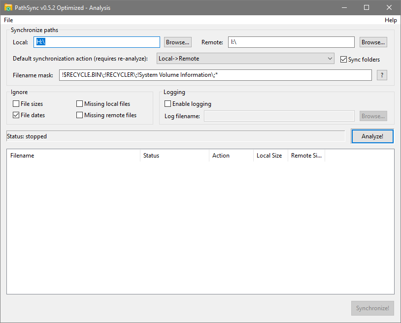

# PathSync v0.5 Optimized

[](https://github.com/HJS-cpu/PathSync_Optimized/actions/workflows/build-windows.yml)
[](http://hjs.bplaced.net/)

A modernized and optimized fork of **PathSync**, the lightweight file synchronization tool originally developed by Cockos Incorporated.



---

## ✨ What's New in v0.5

### 🚀 Performance Optimizations

| Optimization | Improvement |
|--------------|-------------|
| **ListView Rendering** | 5-10x faster UI updates for large directories |
| **Copy Buffer** | 20-50% faster file copying (1MB buffer, was 128KB) |
| **Action Processing** | Enum-based system replaces string comparisons |

### 🆕 New Features

| Feature | Description |
|---------|-------------|
| **Long Path Support** | Paths up to 32,767 characters (breaks the 260 char limit) |
| **Window Memory** | Remembers position, size, and maximized state |

### 🎨 UI Modernization

- Native Windows visual styles
- Modern Segoe UI font
- Cleaner, contemporary appearance

---

## 📥 Download & Links

### 🌐 **Live Website**
**[➡️ Visit Live Website](http://hjs.bplaced.net/)**

### 💾 **Desktop Application**
**[⬇️ Download Latest Release](https://github.com/HJS-cpu/PathSync_Optimized/releases/latest)**

Or download from the [Actions](https://github.com/HJS-cpu/PathSync_Optimized/actions) tab (latest build artifacts).

---

## 🖥️ System Requirements

- Windows XP / Vista / 7 / 8 / 10 / 11
- No installation required - portable executable
- No external dependencies

---

## 🔧 Features

**Synchronization Modes:**
- Local ↔ Local folder sync
- Local ↔ Network share sync (UNC paths supported)

**Analysis & Preview:**
- Preview all changes before synchronizing
- Detailed status for each file (newer, older, missing, identical)
- Configurable default actions

**Filtering:**
- Include/exclude file masks with wildcard support
- Ignore size differences
- Ignore date differences
- Skip missing local/remote files

**Logging:**
- Optional log file for all operations
- Track what was copied, deleted, or skipped

---

## 🚀 Performance Details

### Long Path Support
The Windows MAX_PATH limit of 260 characters has been a long-standing limitation. PathSync v0.5 overcomes this by using the `\\?\` extended path prefix:

- ✅ Works on all Windows versions (no registry changes needed)
- ✅ Supports paths up to 32,767 characters
- ✅ Handles both local (C:\...) and UNC (\\\\server\...) paths

### Optimized ListView Updates
When scanning directories with 10,000+ files, the original PathSync would freeze the UI. The new version uses `WM_SETREDRAW` optimization to batch updates, resulting in 5-10x faster rendering.

### Larger Copy Buffer
Modern SSDs can transfer data much faster than the original 128KB buffer allowed. The new 1MB buffer reduces system call overhead and improves throughput by 20-50%.

---

## 🔒 Safety & Compatibility

- ✅ All optimizations preserve data integrity
- ✅ Fully backward compatible with original .pss settings files
- ✅ Original sync logic unchanged
- ✅ No external dependencies

---

## 🛠️ Building from Source

### Prerequisites
- Visual Studio 2022 (or compatible)
- Windows SDK

### Build via GitHub Actions
Every push triggers an automatic build. Download artifacts from the [Actions](https://github.com/HJS-cpu/PathSync_Optimized/actions) tab.

### Manual Build
```batch
cd PathSync
cl /O2 /EHsc pathsync.cpp fnmatch.cpp wndsize.cpp win32_utf8.c /link /OUT:PathSync.exe
