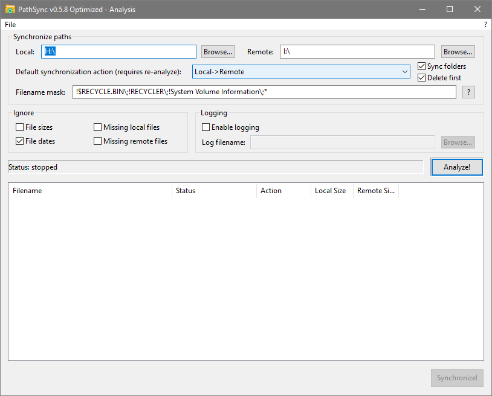

# PathSync Optimized

[](https://gitlab.com/HJS-cpu/pathsync-optimized/-/pipelines)
[](https://gitlab.com/HJS-cpu/pathsync-optimized/-/releases)
[](https://hjs.page.gd/pso/)

A modernized and optimized fork of **PathSync**, the lightweight file synchronization tool originally developed by Cockos Incorporated.



---

## ✨ What's New

### 🚀 Performance Optimizations

| Optimization | Improvement |
|--------------|-------------|
| **ListView Rendering** | 5-10x faster UI updates for large directories |
| **Copy Buffer** | 20-50% faster file copying (1MB buffer, was 128KB) |
| **Action Processing** | Enum-based system replaces string comparisons |

### 🆕 New Features

| Feature | Description |
|---------|-------------|
| **Long Path Support** | Paths up to 32,767 characters (breaks the 260 char limit) |
| **Window Memory** | Remembers position, size, and maximized state |
| **Drag & Drop** | Drop folders directly onto Local/Remote path fields |

### 🎨 UI Modernization

- Native Windows visual styles
- Modern Segoe UI font
- Cleaner, contemporary appearance

---

## 📥 Download & Links

### 🌐 **Live Website**
**[➡️ Visit Live Website](https://hjs.page.gd/pso/)**

### 💾 **Desktop Application**
**[⬇️ Download Latest Release](https://gitlab.com/HJS-cpu/pathsync-optimized/-/releases)**

Available in two versions:
- **Portable** — Single EXE, no installation needed. Just run it.
- **Installer** — Setup with Start Menu shortcut and uninstaller.

Or download the latest build artifacts from the [Pipelines](https://gitlab.com/HJS-cpu/pathsync-optimized/-/pipelines) page.

---

## 🖥️ System Requirements

- Windows XP / Vista / 7 / 8 / 10 / 11
- Portable version requires no installation
- Installer version available with Start Menu integration
- No external dependencies

---

## 🔧 Features

**Synchronization Modes:**
- Local <-> Local folder sync
- Local <-> Network share sync (UNC paths supported)

**Analysis & Preview:**
- Preview all changes before synchronizing
- Detailed status for each file (newer, older, missing, identical)
- Configurable default actions

**Filtering:**
- Include/exclude file masks with wildcard support
- Ignore size differences
- Ignore date differences
- Skip missing local/remote files

**Logging:**
- Optional log file for all operations
- Track what was copied, deleted, or skipped

**Drag & Drop:**
- Drop folders from Windows Explorer directly onto path fields
- Drop on Local field sets Local path
- Drop on Remote field sets Remote path
- Drop .pss settings files to load configurations

---

## 🚀 Performance Details

### Long Path Support
The Windows MAX_PATH limit of 260 characters has been a long-standing limitation. PathSync v0.5 overcomes this by using the `\\?\` extended path prefix:

- ✅ Works on all Windows versions (no registry changes needed)
- ✅ Supports paths up to 32,767 characters
- ✅ Handles both local (C:\...) and UNC (\\\\server\...) paths

### Optimized ListView Updates
When scanning directories with 10,000+ files, the original PathSync would freeze the UI. The new version uses `WM_SETREDRAW` optimization to batch updates, resulting in 5-10x faster rendering.

### Larger Copy Buffer
Modern SSDs can transfer data much faster than the original 128KB buffer allowed. The new 1MB buffer reduces system call overhead and improves throughput by 20-50%.

---

## 🔒 Safety & Compatibility

- ✅ All optimizations preserve data integrity
- ✅ Fully backward compatible with original .pss settings files
- ✅ Original sync logic unchanged
- ✅ No external dependencies

---

## 🛠️ Building from Source

### Prerequisites
- Visual Studio 2022 (or compatible)
- Windows SDK

### Build via CI/CD
Every push triggers an automatic build. Download artifacts from the [Pipelines](https://gitlab.com/HJS-cpu/pathsync-optimized/-/pipelines) page.

### Manual Build
```batch
cd PathSync
cl /O2 /EHsc pathsync.cpp fnmatch.cpp wndsize.cpp win32_utf8.c /link /OUT:PathSync.exe
```

---

## 🙏 Credits

- **Original PathSync** by [Cockos Incorporated](https://www.cockos.com/)
- **Optimizations** by HJS (2025-2026)

---

## 📄 License

This project is licensed under the GNU General Public License v2.0 - see the [LICENSE](LICENSE) file for details.

Based on the original PathSync source code by Cockos Incorporated.

---

## 📝 Changelog

### v0.5.5 (16.04.2026)
- Added: "Delete first" option — removes target files/folders before copying new ones (saves space on tight targets)
- Fixed: Sync errors when deleting folders after sorting the list by column header
- Fixed: List is now always sorted in safe execution order (parent directories after their contents) before sync starts
- Fixed: Filename column sorting now preserves the parent-after-children invariant

### v0.5.4 (14.04.2026)
- Added: Column sorting — click any column header to sort ascending/descending with arrow indicator
- Improved: Optimized sort performance with pre-built text cache for Status/Action columns

### v0.5.3 (06.03.2026)
- Added: Website link in Help menu (? > Website)
- Security: Replaced sprintf with _snprintf to prevent buffer overflows
- Fixed: Format string vulnerability in log output
- Fixed: Directory creation error reporting (errors were silently ignored)
- Removed: Deprecated Windows 9x compatibility code
- Removed: Obsolete Visual Studio 6 project files

### v0.5.2 (01.01.2026)
- Fixed: Full Unicode/UTF-8 support for file and folder names with special characters (umlauts, accents, etc.)

### v0.5.1 (17.12.2025)
- Added: Drag & Drop for folder paths

### v0.5 (2025)
- Added: Long path support (>260 characters)
- Added: Window position/size persistence
- Added: Drag & Drop for folder paths
- Added: Modern Windows visual styles
- Added: Segoe UI font
- Improved: ListView rendering performance (5-10x faster)
- Improved: File copy buffer (1MB, 20-50% faster)
- Improved: Action processing with enum-based system
